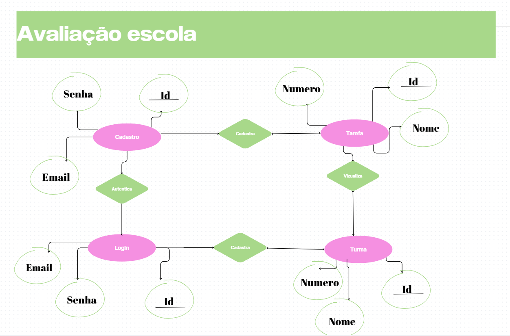
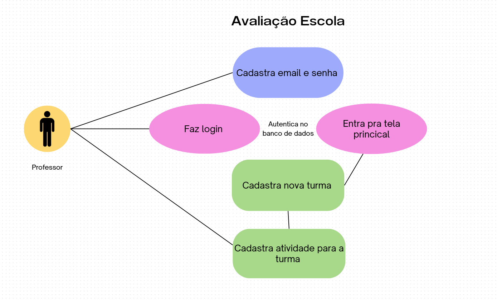
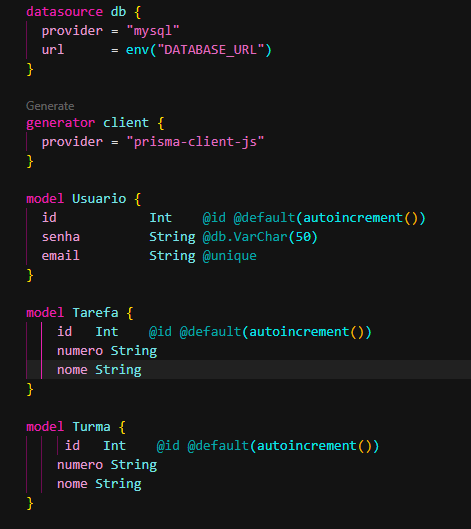

# Avaliação Escola

## Tecnologias
- JavaScript
- Prisma
- Mysql
- Node.js
- html
- css

## Como testar
- Clone o repositório
- Abra com o VsCode
- Coloque o xampp e o sql pra rodar
- Dentro de ./api crie um arquivo .env com a variavel:
```bash 
DATABASE_URL="mysql://root@localhost:3306/bdprofessor?timezone=UTC"
```
- Aba o terminal cmd e execute os comandos:
```bash
npm i 
npx prisma migrate dev --name init
npx nodemon server.js
```
- Antes de testar direto pelo front, abra o insomnia para cadastrar um professor
url POST: https://localhost:3000/cadastrar
```bash
{
"email":"exemplo@gmail.com",
"senha":"12345"
}
```

## Print Screen



